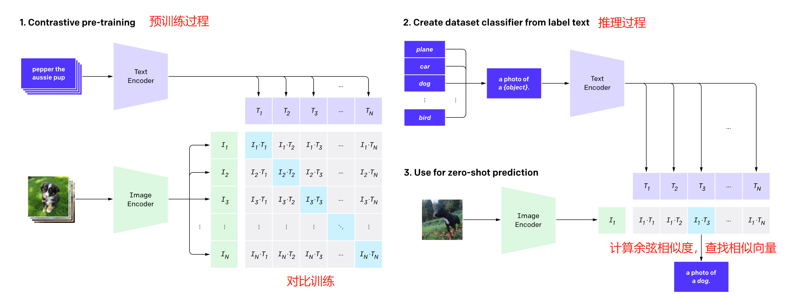
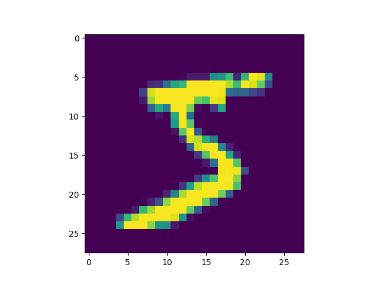
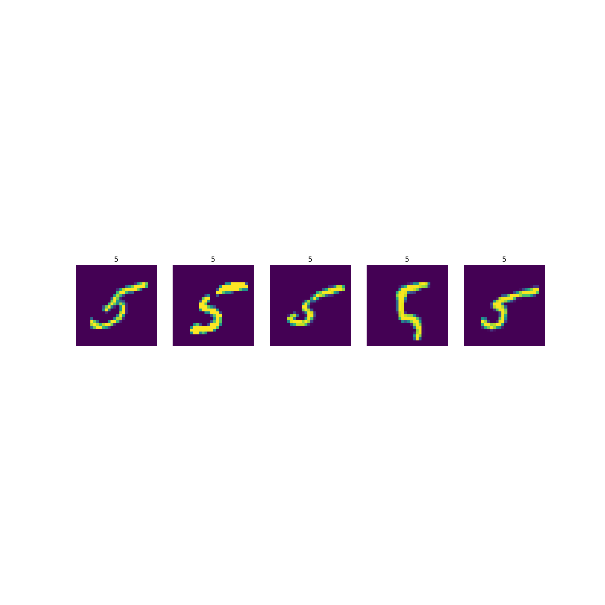

# mnist-clip

a super easy clip model with mnist dataset for study

基于mnist手写数字训练的clip模型，用作学习多模态模型的用途，只能预测0-9

## 作业结构

本项目实现了一个基于MNIST数据集的简化版CLIP模型，项目结构如下：

### 核心文件

- **clip.py**: CLIP模型的核心实现，包含TODO任务0和任务1
  - 实现了多模态CLIP模型，将图像和文本嵌入到共享特征空间

- **train.ipynb**: 训练代码
  - 包含TODO任务2: 实现对比学习损失函数
  - 包含训练过程中的日志
  - 将loss随循环的变化可视化
  
- **inference.ipynb**: 推理代码
  - 展示CLIP模型的两种能力：图像分类和相似图像检索，包含TODO任务3和任务4
  - 增添了遍历整个测试集的方法，检测模型对图像分类的准确性

### 输出目录

- **output/**: 存放实验结果
  - **similarity{n}.pdf**: 对每个数字n找到的5张最相似图像
  - **training_loss.pdf**: 训练损失曲线，展示模型训练过程

### 预训练模型

- **model.pth**: 预训练CLIP模型权重

### 任务列表

1. **TASK 0**: 完成CLIP模型的初始化和前向传播（在clip.py中）
2. **TASK 1**: 完成CLIP模型的初始化（在clip.py中）
3. **TASK 2**: 实现对比学习损失函数（在train.ipynb中）
4. **TASK 3**: 实现CLIP模型进行预测的代码（在inference.ipynb中）
5. **TASK 4**: 使用CLIP的图像编码器进行相似图像检索（在inference.ipynb中）


## 模型

尝试过CLIP训练图文数据（coco等），loss收敛效果不好，可能是模型给的太复杂数据集太小导致的，所以就用mnist作为数据集用简单模型做一下了。

* img_encoder采用resnet残差网络结构，简单输出image embedding
* text_encoder没有用transformer，接收0~9数字ID，简单embedding+dense输出text embedding
* image embedding和text embedding做点积，得到logits，点积最大的(image,text)对最为相似

----

**resnet residual**


----

**clip model**


## 训练

python train.py

稍微训练一阵子，loss基本收敛到如下水平：

```
iter:0,loss:0.0012023616582155228
...
...
```

## 推理

python inference.py

```
正确分类: 5
tensor([[ -5.4331,  -3.2287, -13.9387,   6.4354,  -5.6840,  16.4233,   1.9771,
          -5.5376,   6.2783,   2.4510]], device='cuda:0',
       grad_fn=<MmBackward0>)
CLIP分类: 5
```

**要预测的图片**



**寻找的相似图片**

